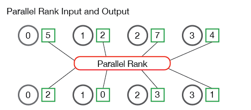
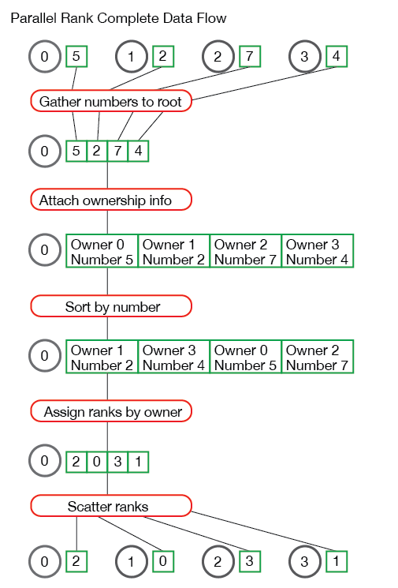

In the [previous lesson]({{ site.baseurl }}/tutorials/mpi-scatter-gather-and-allgather/), we went over `MPI_Scatter`, `MPI_Gather`, and `MPI_Allgather`. We are going to expand on basic collectives in this lesson by coding a useful function for your MPI toolkit - parallel rank.

> **Note** - All of the code for this site is on [GitHub]({{ site.github.repo }}). This tutorial's code is under [tutorials/performing-parallel-rank-with-mpi/code]({{ site.github.code }}/tutorials/performing-parallel-rank-with-mpi/code).

## Parallel rank - problem overview
When processes all have a single number stored in their local memory, it can be useful to know what order their number is in respect to the entire set of numbers contained by all processes. For example, a user might be benchmarking the processors in an MPI cluster and want to know the order of how fast each processor relative to the others. This information can be used for scheduling tasks and so on. As you can imagine, it is rather difficult to find out a number's order in the context of all other numbers if they are spread across processes. This problem - the parallel rank problem - is what we are going to solve in this lesson.

An illustration of the input and output of parallel rank is below:



The processes in the illustration (labeled 0 through 3) start with four numbers - 5, 2, 7, and 4. The parallel rank algorithm then computes that process 1 has rank 0 in the set of numbers (i.e. the first number), process 3 has rank 1, process 0 has rank 2, and process 2 has the last rank in the set of numbers. Pretty simple, right?

## Parallel rank API definition
Before we dive into solving the parallel rank problem, let's first decide on how our function is going to behave. Our function needs to take a number on each process and return its associated rank with respect to all of the other numbers across all processes. Along with this, we will need other miscellaneous information, such as the communicator that is being used, and the datatype of the number being ranked. Given this function definition, our prototype for the rank function looks like this:

```cpp
TMPI_Rank(
    void *send_data,
    void *recv_data,
    MPI_Datatype datatype,
    MPI_Comm comm)
```

`TMPI_Rank` takes a `send_data` buffer that contains one number of `datatype` type. The `recv_data` receives exactly one integer on each process that contains the rank value for `send_data`. The `comm` variable is the communicator in which ranking is taking place.


> **Note** - The MPI standard explicitly says that users should not name their own functions `MPI_<something>` to avoid confusing user functions with functions in the MPI standard itself. Thus, we will prefix functions in these tutorials with `T`.

## Solving the parallel rank problem
Now that we have our API definition, we can dive into how the parallel rank problem is solved. The first step in solving the parallel rank problem is ordering all of the numbers across all of the processes. This has to be accomplished so that we can find the rank of each number in the entire set of numbers. There are quite a few ways how we could accomplish this. The easiest way is gathering all of the numbers to one process and sorting the numbers. In the example code ([tmpi_rank.c]({{ site.github.code }}/tutorials/performing-parallel-rank-with-mpi/code/tmpi_rank.c)), the `gather_numbers_to_root` function is responsible for gathering all of the numbers to the root process.

```cpp
// Gathers numbers for TMPI_Rank to process zero. Allocates space for
// the MPI datatype and returns a void * buffer to process 0.
// It returns NULL to all other processes.
void *gather_numbers_to_root(void *number, MPI_Datatype datatype,
                             MPI_Comm comm) {
  int comm_rank, comm_size;
  MPI_Comm_rank(comm, &comm_rank);
  MPI_Comm_size(comm, &comm_size);

  // Allocate an array on the root process of a size depending
  // on the MPI datatype being used.
  int datatype_size;
  MPI_Type_size(datatype, &datatype_size);
  void *gathered_numbers;
  if (comm_rank == 0) {
    gathered_numbers = malloc(datatype_size * comm_size);
  }

  // Gather all of the numbers on the root process
  MPI_Gather(number, 1, datatype, gathered_numbers, 1,
             datatype, 0, comm);

  return gathered_numbers;
}
```

The `gather_numbers_to_root` function takes the number (i.e. the `send_data` variable) to be gathered, the `datatype` of the number, and the `comm` communicator. The root process must gather `comm_size` numbers in this function, so it mallocs an array of `datatype_size * comm_size` length. The `datatype_size` variable is gathered by using a new MPI function in this tutorial - `MPI_Type_size`. Although our code only supports `MPI_INT` and `MPI_FLOAT` as the datatype, this code could be extended to support datatypes of varying sizes. After the numbers have been gathered on the root process with `MPI_Gather`, the numbers must be sorted on the root process so their rank can be determined.

## Sorting numbers and maintaining ownership
Sorting numbers is not necessarily a difficult problem in our ranking function. The C standard library provides us with popular sorting algorithms like `qsort`. The difficulty in sorting with our parallel rank problem is that we must maintain the ranks that sent the numbers to the root process. If we were to sort the list of numbers gathered to the root process without attaching additional information to the numbers, the root process would have no idea how to send the numbers' ranks back to the requesting processes!

In order to facilitate attaching the owning process to the numbers, we create a struct in the code that holds this information. Our struct definition is as follows:

```cpp
// Holds the communicator rank of a process along with the
// corresponding number. This struct is used for sorting
// the values and keeping the owning process information
// in tact.
typedef struct {
  int comm_rank;
  union {
    float f;
    int i;
  } number;
} CommRankNumber;
```

The `CommRankNumber` struct holds the number we are going to sort (remember that it can be a float or an int, so we use a union) and it holds the communicator rank of the process that owns the number. The next part of the code, the `get_ranks` function, is responsible for creating these structs and sorting them.


```cpp
// This function sorts the gathered numbers on the root process and
// returns an array of ordered by the process's rank in its
// communicator. Note - this function is only executed on the root
// process.
int *get_ranks(void *gathered_numbers, int gathered_number_count,
               MPI_Datatype datatype) {
  int datatype_size;
  MPI_Type_size(datatype, &datatype_size);

  // Convert the gathered number array to an array of CommRankNumbers.
  // This allows us to sort the numbers and also keep the information
  // of the processes that own the numbers in tact.
  CommRankNumber *comm_rank_numbers = malloc(
    gathered_number_count * sizeof(CommRankNumber));
  int i;
  for (i = 0; i < gathered_number_count; i++) {
    comm_rank_numbers[i].comm_rank = i;
    memcpy(&(comm_rank_numbers[i].number),
           gathered_numbers + (i * datatype_size),
           datatype_size);
  }

  // Sort the comm rank numbers based on the datatype
  if (datatype == MPI_FLOAT) {
    qsort(comm_rank_numbers, gathered_number_count,
          sizeof(CommRankNumber), &compare_float_comm_rank_number);
  } else {
    qsort(comm_rank_numbers, gathered_number_count,
          sizeof(CommRankNumber), &compare_int_comm_rank_number);
  }

  // Now that the comm_rank_numbers are sorted, make an array of rank
  // values for each process. The ith element of this array contains
  // the rank value for the number sent by process i.
  int *ranks = (int *)malloc(sizeof(int) * gathered_number_count);
  for (i = 0; i < gathered_number_count; i++) {
    ranks[comm_rank_numbers[i].comm_rank] = i;
  }

  // Clean up and return the rank array
  free(comm_rank_numbers);
  return ranks;
}
```

The `get_ranks` function first creates an array of `CommRankNumber` structs and attaches the communicator rank of the process that owns the number. If the datatype is `MPI_FLOAT`, `qsort` is called with a special sorting function for our array of structs (see [tmpi_rank.c]({{ site.github.code }}/tutorials/performing-parallel-rank-with-mpi/code) for the code). Likewise, we use a different sorting function if the datatype is `MPI_INT`.

After the numbers are sorted, we must create an array of ranks in the proper order so that they can be scattered back to the requesting processes. This is accomplished by making the `ranks` array and filling in the proper rank values for each of the sorted `CommRankNumber` structs.

## Putting it all together
Now that we have our two primary functions, we can put them all together into our `TMPI_Rank` function. This function gathers the numbers to the root process, sorts the numbers to determine their ranks, and then scatters the ranks back to the requesting processes. The code is shown below:

```cpp
// Gets the rank of the recv_data, which is of type datatype. The rank
// is returned in send_data and is of type datatype.  
int TMPI_Rank(void *send_data, void *recv_data, MPI_Datatype datatype,
             MPI_Comm comm) {
  // Check base cases first - Only support MPI_INT and MPI_FLOAT for
  // this function.
  if (datatype != MPI_INT && datatype != MPI_FLOAT) {
    return MPI_ERR_TYPE;
  }

  int comm_size, comm_rank;
  MPI_Comm_size(comm, &comm_size);
  MPI_Comm_rank(comm, &comm_rank);

  // To calculate the rank, we must gather the numbers to one
  // process, sort the numbers, and then scatter the resulting rank
  // values. Start by gathering the numbers on process 0 of comm.
  void *gathered_numbers = gather_numbers_to_root(send_data, datatype,
                                                  comm);

  // Get the ranks of each process
  int *ranks = NULL;
  if (comm_rank == 0) {
    ranks = get_ranks(gathered_numbers, comm_size, datatype);
  }

  // Scatter the rank results
  MPI_Scatter(ranks, 1, MPI_INT, recv_data, 1, MPI_INT, 0, comm);

  // Do clean up
  if (comm_rank == 0) {
    free(gathered_numbers);
    free(ranks);
  }
}
```

The `TMPI_Rank` function uses the two functions we just created, `gather_numbers_to_root` and `get_ranks`, to get the ranks of the numbers. The function then performs the final `MPI_Scatter` to scatter the resulting ranks back to the processes.

If you have had trouble following the solution to the parallel rank problem, I have included an illustration of the entire data flow of our problem using an example set of data:



Have any questions about how the parallel rank algorithm works? Leave them below!

## Running our parallel rank algorithm
I have included a small program in the example code to help test out our parallel rank algorithm. The code can be viewed in the [random_rank.c file]({{ site.github.code }}/tutorials/performing-parallel-rank-with-mpi/code/random_rank.c) file in the [lesson code]({{ site.github.code }}/tutorials/performing-parallel-rank-with-mpi/code).

The example application simply creates a random number on each process and calls `TMPI_Rank` to get the rank of each number. If you run the random_rank program from the *tutorials* directory of the [repo]({{ site.github.code }}), the output should look similar to this.

```
>>> cd tutorials
>>> ./run.py random_rank
mpirun -n 4  ./random_rank 100
Rank for 0.242578 on process 0 - 0
Rank for 0.894732 on process 1 - 3
Rank for 0.789463 on process 2 - 2
Rank for 0.684195 on process 3 - 1
```

## Up next
In our next lesson, we start covering advanced collective communication. The next lesson is about [using MPI_Reduce and MPI_Allreduce to perform number reduction]({{ site.baseurl }}/tutorials/mpi-reduce-and-allreduce/).

For all lessons, go the the [MPI tutorials]({{ site.baseurl }}/tutorials/).
